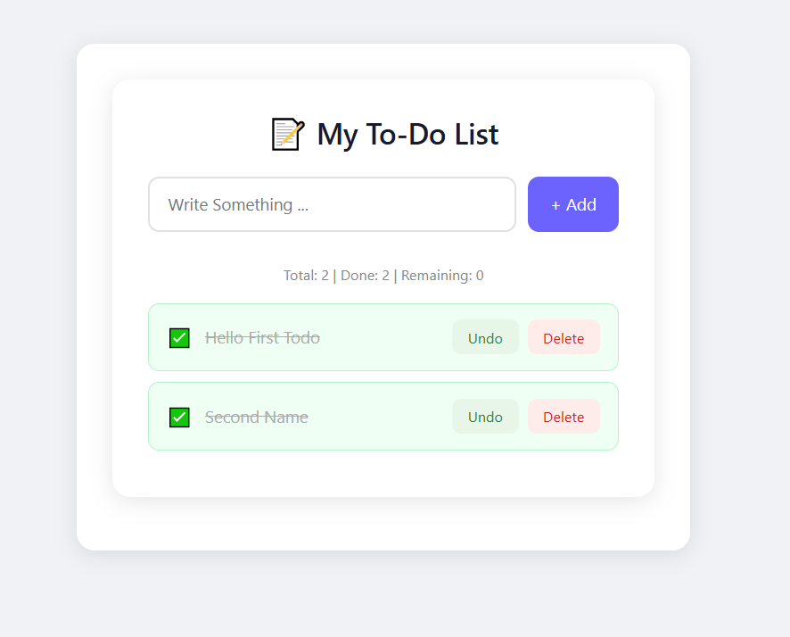
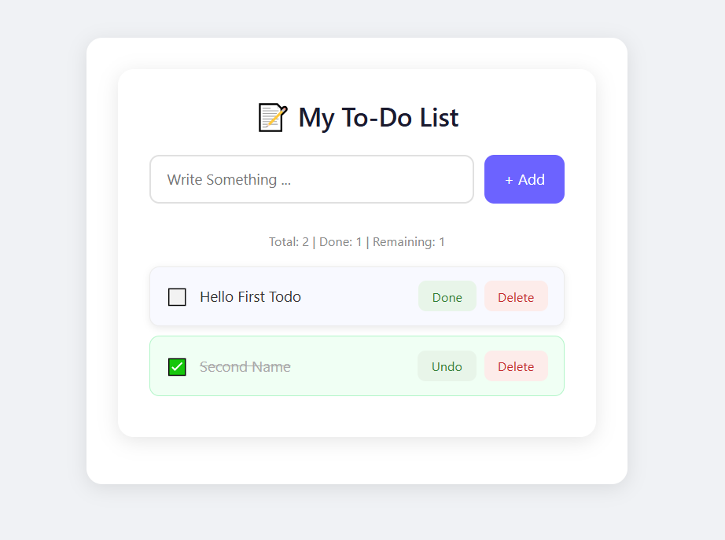
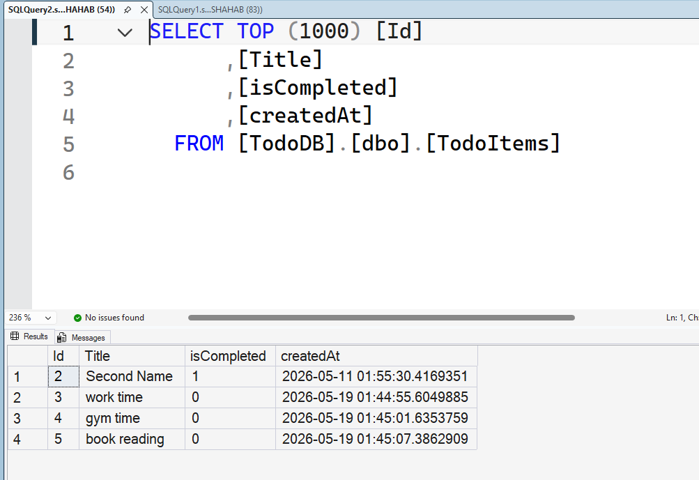

# ✅ TodoList App

## 📋 Features
➕ Add Task  
✅ Mark as Completed  
↩️ Undo Task  
❌ Delete Task  
💾 Database Integration (CRUD Operations)

## 🖼️ Screenshots

### 🏠 Todo Home

### ↩️ Undo Task

### 💾 Database

## 🛠️ Tech Stack
C# | Windows Forms | .NET | SQL Server (or Local DB)
